# Project Mort: The WhatsApp Crypto Companion

<div align="center">
  
</div>

Mort is a revolutionary portfolio management bot that brings cryptocurrency to the world's most popular messaging app: WhatsApp. It allows users to seamlessly send, receive, and earn crypto with the same ease as sending a text message. By removing the barriers of complex apps and wallet setups, Mort makes crypto accessible, intuitive, and fun for everyone. 

📱 Try Mort instantly on WhatsApp: [https://wa.me/message/NZE2L3J66OL4D1](https://wa.me/message/NZE2L3J66OL4D1)


## The Problem We Solve

The mass adoption of cryptocurrency is hindered by significant friction. New users are often intimidated by:
*   The need to download and learn new, complex applications.
*   The confusing process of managing wallet addresses and seed phrases.
*   A general lack of trust and transparency in the space.

Mort tackles these problems head-on by leveraging an application that billions of people already know and trust.

<div align="center">
  <b>POV: newbies in crypto</b>
  <br>
  
</div>


## Key Features

*   **Simple Interface:** The entire experience lives within WhatsApp, providing a native and familiar environment.
*   **Frictionless Onboarding:** Users create a secure, self-custodial wallet in seconds using **Privy**, without ever needing to manage a seed phrase.
*   **Intuitive Transactions:** Send and receive crypto using simple wallet addresses or unique, human-readable usernames.
*   **Provably Fair Gaming:** Mort integrates on-chain games like Coin Flip, Rock-Paper-Scissors, and Ranmi. To guarantee absolute fairness, all game outcomes are determined by **Chainlink VRF (Verifiable Random Function)**.

---

## Screenshots

### 💼 Wallet & Portfolio Management
Create your wallet, check balance, and manage your crypto assets directly in WhatsApp<br>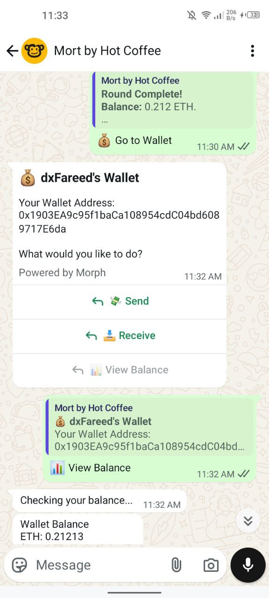 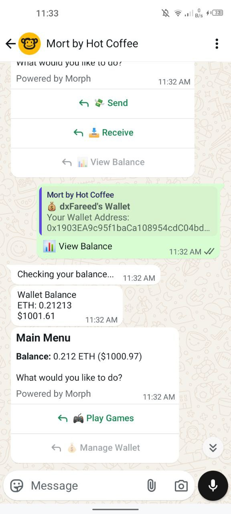

### 💸 Send Crypto to Friends
Send crypto to your friends using their username or wallet address - as easy as sending a message<br>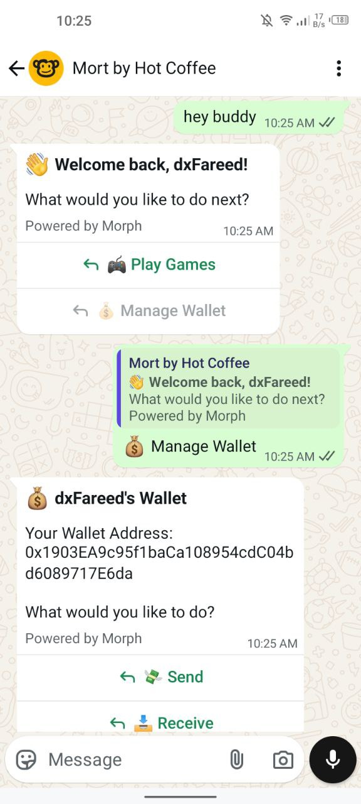 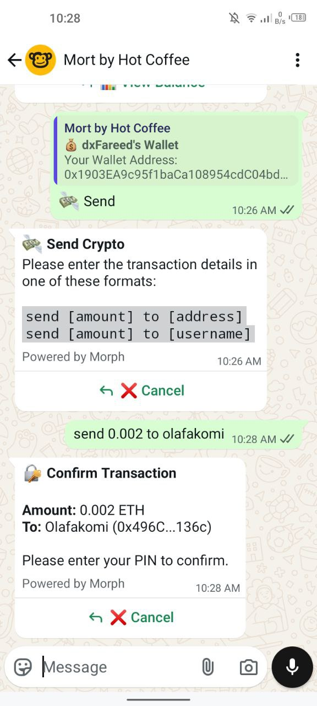

### 🎲 Coin Flip Game
Test your luck with our provably fair coin flip game - choose heads or tails, place your bet, and watch the magic happen on-chain<br>
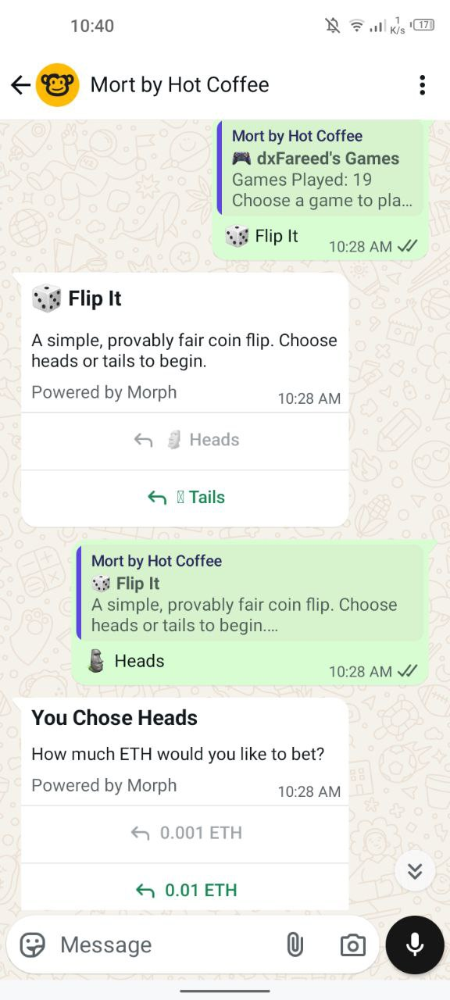 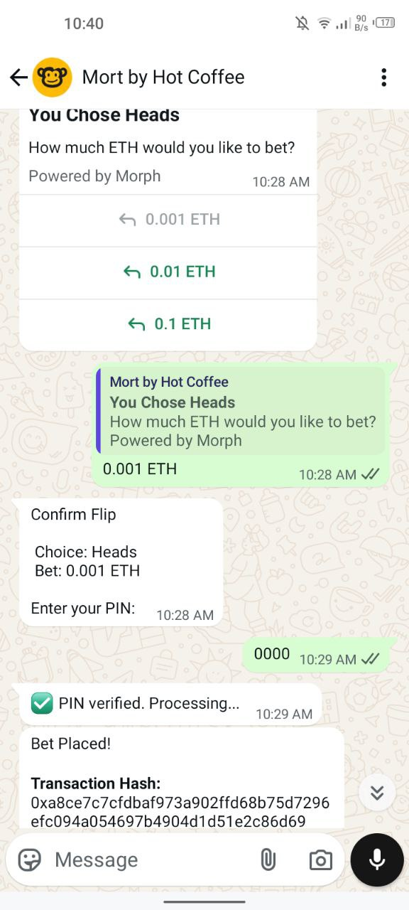 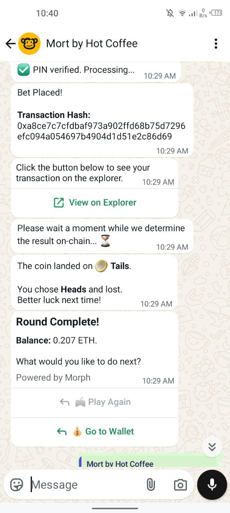

> **Note:** PIN will be masked on production using Whatsapp payment api

### ✌️ Rock Paper Scissors
Challenge the computer to a game of Rock Paper Scissors with provably fair outcomes - choose rock 👊, paper ✋, or scissors ✌️ and let Chainlink VRF determine the winner <br> 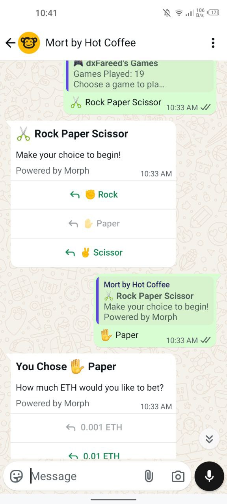 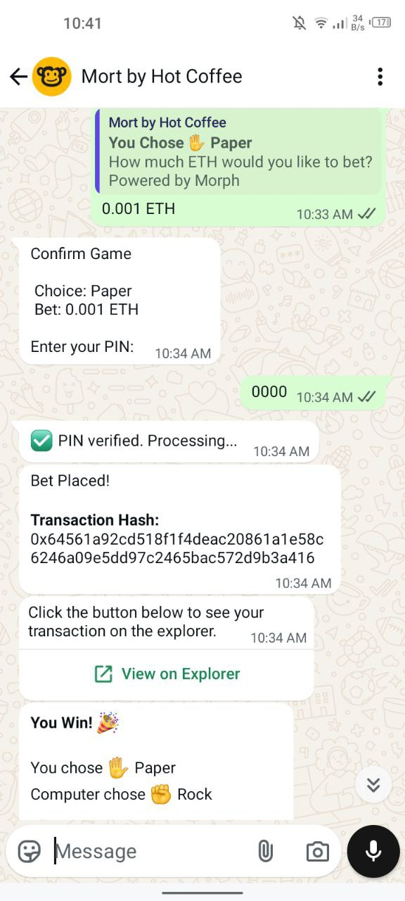 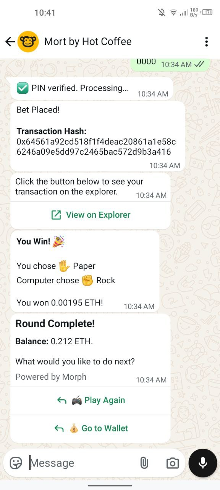

### 🎮 Ranmi
Test your luck in this unique number guessing game - we'll generate 5 numbers and if you can guess the winning one, you win big! All outcomes are provably fair through Chainlink VRF <br> 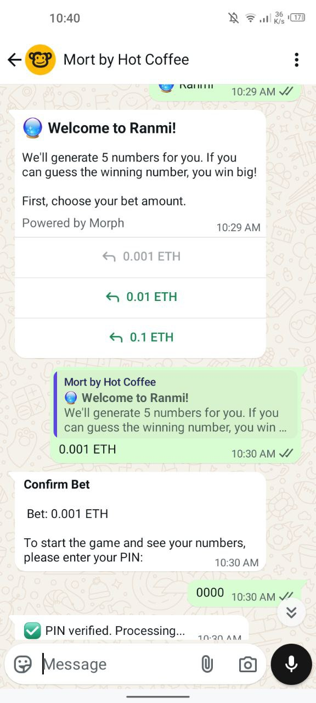 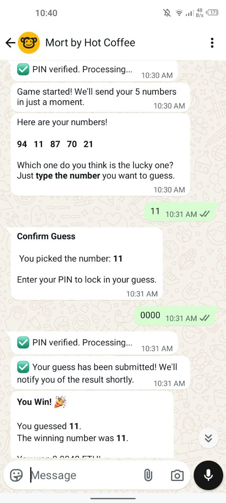 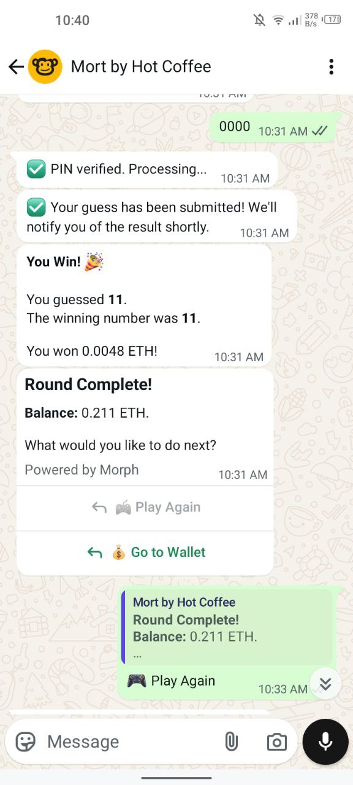


## Technical Architecture & Innovation 🛠️

Mort's architecture is designed for a seamless user experience on the frontend and a robust, innovative solution on the backend.

*   **Platform:** The user-facing application is built on the **WhatsApp Business API**, managed by a **Node.js (Express)** backend. This backend handles all user state, interactions, and orchestrates blockchain transactions.

*   **Wallet & Authentication:** We use **Privy** for seamless, non-custodial wallet creation. This allows users to get a secure wallet tied to their WhatsApp identity, removing a major barrier to entry. User metadata is securely stored in **Firebase Firestore**.

*   **Primary Blockchain (User-Facing):** All primary user transactions—such as placing bets and transferring funds—occur on the **Morph Holesky** network. We chose Morph for its scalability and low transaction costs.

*   **Key Innovation: Cross-Chain VRF Relayer:**
    *   **The Challenge:** Our core commitment is provable fairness, which requires Chainlink's Verifiable Random Function (VRF). However, Chainlink VRF is not yet deployed on the Morph Holesky network.
    *   **Our Solution:** To solve this, we engineered a custom **cross-chain relayer service**. This service bridges the gap between Morph Holesky and a network where VRF is available (Base Sepolia).
    *   **How It Works:**
        1.  A user initiates a game on Morph Holesky, which emits an event from our game contract (e.g., `FlipInitiated`).
        2.  Our Node.js relayer service, listening on Morph, detects this event.
        3.  The relayer then calls a dedicated VRF requester contract that we deployed on **Base Sepolia**.
        4.  After Chainlink fulfills the randomness request on Base Sepolia, our relayer detects the `RandomnessFulfilled` event.
        5.  Finally, the relayer securely transmits the verified random number back to our primary game contract on **Morph Holesky** to settle the game.

This innovative relayer architecture allows us to provide mathematically verifiable, tamper-proof game outcomes while still building our core user experience on the emerging and efficient Morph network.

---

## Getting Started  🚀 

The project is divided into two main parts: the `contracts` and the `bot`.

### 1. Deploying the Smart Contracts

The smart contracts must be deployed first. The game contracts are deployed to **Morph Holesky**, and the VRF requester contracts are deployed to **Base Sepolia**.

**A. Setup:**
1.  Navigate to the contracts directory: `cd contracts`
2.  Install dependencies: `npm install`
3.  Create a `.env` file and populate it with your `PRIVATE_KEY`, `MORPH_HOLESKY_RPC_URL`, `BASE_SEPOLIA_RPC_URL`, and `BASESCAN_API_KEY`. You will also need to add your Chainlink `VRF_COORDINATOR`, `KEY_HASH`, and `SUB_ID` for the Base Sepolia network.

**B. Deployment:**
1.  **Deploy VRF Requesters to Base Sepolia:**
    ```bash
    npx hardhat run scripts/deployVrf.js --network base_sepolia
    npx hardhat run scripts/deployVrfRanmi.js --network base_sepolia
    ```
2.  **Deploy Game Contracts to Morph Holesky:**
    ```bash
    npx hardhat run scripts/deployFlip.js --network morph_holesky
    npx hardhat run scripts/deployRPS.js --network morph_holesky
    npx hardhat run scripts/deployRanmi.js --network morph_holesky
    ```
3.  **Update `.env` for the Bot:** Copy the deployed contract addresses from the terminal output into the `.env` file for the `bot` application.

#### Using Existing Contracts
Alternatively, you can connect the bot to our already deployed contracts. Use these addresses in your `bot/.env` file:

**Morph Holesky (Game Contracts):**
```
FLIP_GAME_CONTRACT_ADDRESS=0x8A768deEC38363C60477A7046FD4e3236b98a3b0
RPS_GAME_CONTRACT_ADDRESS=0xfE5338B161b3B02FC03CF854F91bdC7A353061C0
RANMI_GAME_CONTRACT_ADDRESS=0x6Ad4548EE077821908cD9591168A2636F54498D2
```

**Base Sepolia (VRF Requester Contracts):**
```
VRF_REQUESTER_FLIP_RPS_ADDRESS=0x7EEFC42b510dF33097a8AC5EFE9533494ABcA78B
VRF_REQUESTER_RANMI_ADDRESS=0xE33bEEd4c1C1f5c07d6F3e3c68Ed2a60e7D15EA7
```

### 2. Running the Bot & Relayer

The bot and the relayer service run from the same application.

**A. Setup:**
1.  Navigate to the bot directory: `cd bot`
2.  Install dependencies: `npm install`
3.  Create a `.env` file and populate it with your WhatsApp, Privy, and Firebase credentials, as well as the contract addresses you just deployed. See `bot/config/index.js` for a full list of required variables.

**B. Running the Application:**
1.  Start the server:
    ```bash
    npm start
    ```
2.  The server will start, and the relayer service will begin listening for events on both chains.
3.  Configure your WhatsApp Business Account webhook to point to your server's `/webhook` endpoint to begin receiving messages.

---

## Our Vision

Our vision is to make crypto so easy, anyone can use it on WhatsApp. We're removing technical barriers to open the digital economy for all.

<div align="left">
  <h5>Learn More About Our Vision</h5>
  
  [](https://youtu.be/wgLHYpvrwqM)
</div>

